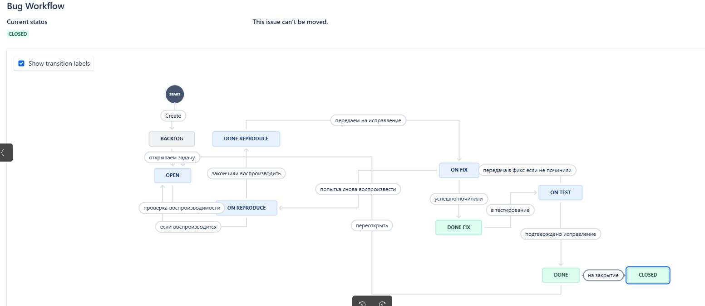
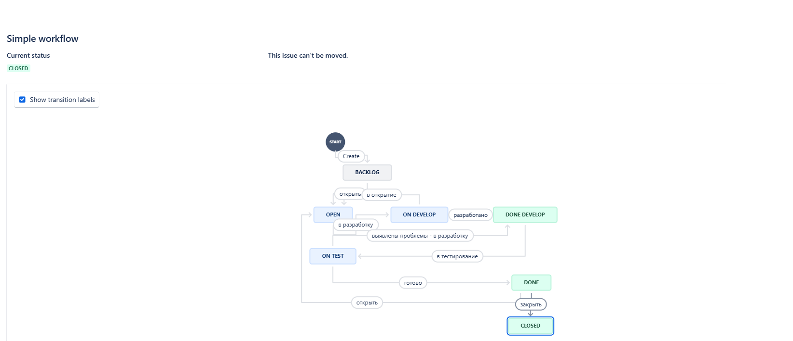

# Домашнее задание к занятию 7 «Жизненный цикл ПО»
 
  Workflow для Bug  
      
  Workflow для остального
    

**Ссылки**  

[Bug Workflow](/Bug_Workflow.xml)  
[Simple workflow](/Simple_workflow.xml)
